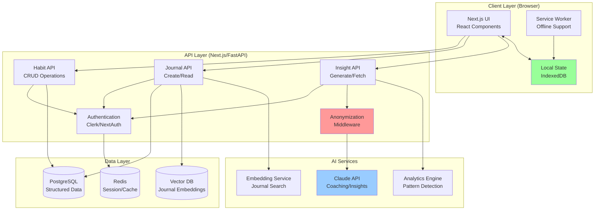

# HabitFlow - Technical Architecture

**Version:** 1.0
**Date:** 2025-11-17
**Status:** Draft

---

## Table of Contents
1. [System Overview](#system-overview)
2. [Architecture Principles](#architecture-principles)
3. [High-Level Architecture](#high-level-architecture)
4. [Technology Stack](#technology-stack)
5. [Data Architecture](#data-architecture)
6. [AI Pipeline Architecture](#ai-pipeline-architecture)
7. [Privacy & Security Architecture](#privacy--security-architecture)
8. [Deployment Architecture](#deployment-architecture)
9. [Development Workflow](#development-workflow)

---

## System Overview

HabitFlow is a modern web application built with a **local-first, privacy-preserving architecture** that enables intelligent habit tracking through AI while maintaining user control over data.

### Key Architectural Goals
1. **Local-first**: Data stored locally first, synced to cloud for backup/cross-device
2. **Privacy-preserving**: Anonymization layer before any external AI calls
3. **Modular AI**: Pluggable AI providers (Claude, GPT, local LLMs)
4. **Fast & responsive**: SSR + client-side caching for sub-second interactions
5. **Developer-friendly**: Type-safe, well-tested, easy to contribute to

---

## Architecture Principles

### 1. Clean Architecture
- **Separation of concerns**: UI, business logic, data access
- **Dependency inversion**: Core domain logic has no external dependencies
- **Testability**: Business logic is pure functions, easy to unit test

### 2. Domain-Driven Design (Lite)
- **Entities**: Habit, HabitLog, JournalEntry, Insight
- **Value Objects**: Streak, Frequency, Category
- **Services**: HabitService, InsightService, AICoachService
- **Repositories**: Abstract data persistence

### 3. API-First Design
- **GraphQL or REST**: RESTful for simplicity, GraphQL for flexibility
- **Contract-first**: Define API schema before implementation
- **Versioning**: API versioning strategy (v1, v2, etc.)

### 4. Privacy by Design
- **Data minimization**: Collect only what's needed
- **Anonymization by default**: Strip PII before external calls
- **User control**: Users decide what data is shared

---

## High-Level Architecture



---

## Technology Stack

### Frontend
- **Framework**: Next.js 15 (App Router)
  - Why: SSR, RSC, fast, great DX
- **Language**: TypeScript 5.3+
  - Why: Type safety, better IDE support
- **UI Library**: React 19
  - Why: Latest features, performance improvements
- **Styling**: Tailwind CSS 4
  - Why: Utility-first, fast prototyping, small bundle
- **UI Components**: shadcn/ui
  - Why: Accessible, customizable, Radix primitives
- **State Management**:
  - Server state: TanStack Query (React Query)
  - Local state: Zustand or React Context
  - Why: Simple, performant, great DX
- **Local Storage**: IndexedDB (via Dexie.js)
  - Why: Offline support, large storage capacity
- **Forms**: React Hook Form + Zod
  - Why: Performant, type-safe validation
- **Charts**: Recharts or Chart.js
  - Why: React-friendly, customizable

### Backend
**Option 1: Next.js API Routes (Recommended for MVP)**
- **Framework**: Next.js 15 API routes (App Router)
- **Why**: Single codebase, simpler deployment, type sharing

**Option 2: Separate FastAPI Backend (for scale)**
- **Framework**: FastAPI (Python)
- **Why**: Better async performance, Python ML ecosystem

### Database
- **Primary DB**: PostgreSQL 16
  - Why: Reliable, ACID, great for structured data
  - Schema: Habits, HabitLogs, JournalEntries, Users
- **Vector DB**: pgvector (PostgreSQL extension) or Pinecone
  - Why: Semantic search on journal entries
- **Cache**: Redis (optional for MVP)
  - Why: Session storage, rate limiting, caching

### AI Services
- **Primary LLM**: Anthropic Claude (Opus or Sonnet)
  - Why: Best for coaching tone, long context for insights
- **Embeddings**: OpenAI text-embedding-3-small or Anthropic Voyager
  - Why: Fast, cheap, good quality
- **Future**: Ollama for local LLM support
  - Why: Privacy, offline support

### Authentication
- **Service**: Clerk or NextAuth.js v5
  - Why Clerk: Best DX, built-in UI, social logins
  - Why NextAuth: Open-source, self-hosted option

### Deployment
- **Frontend**: Vercel
  - Why: Zero-config Next.js deployment, edge functions
- **Backend** (if separate): Railway or Fly.io
  - Why: Simple, cheap, good DX
- **Database**: Vercel Postgres or Supabase
  - Why: Managed, integrates with Vercel
- **Vector DB**: Pinecone or Supabase pgvector
  - Why: Managed, scalable

---

## Data Architecture

### Database Schema

```sql
-- Users table (managed by Clerk/NextAuth)
CREATE TABLE users (
  id UUID PRIMARY KEY DEFAULT gen_random_uuid(),
  clerk_id TEXT UNIQUE NOT NULL, -- External auth ID
  email TEXT UNIQUE NOT NULL,
  created_at TIMESTAMP DEFAULT NOW(),
  updated_at TIMESTAMP DEFAULT NOW(),
  settings JSONB DEFAULT '{}'::jsonb -- Privacy settings, coach preferences
);

-- Habits table
CREATE TABLE habits (
  id UUID PRIMARY KEY DEFAULT gen_random_uuid(),
  user_id UUID REFERENCES users(id) ON DELETE CASCADE,
  name TEXT NOT NULL,
  description TEXT,
  category TEXT CHECK (category IN ('health', 'work', 'learning', 'social', 'other')),
  frequency JSONB NOT NULL, -- {"type": "daily"} or {"type": "weekly", "days": ["Mon", "Wed"]}
  created_at TIMESTAMP DEFAULT NOW(),
  archived_at TIMESTAMP,
  sort_order INTEGER DEFAULT 0,

  CONSTRAINT unique_active_habit_name UNIQUE (user_id, name) WHERE archived_at IS NULL
);

-- Habit logs table
CREATE TABLE habit_logs (
  id UUID PRIMARY KEY DEFAULT gen_random_uuid(),
  habit_id UUID REFERENCES habits(id) ON DELETE CASCADE,
  date DATE NOT NULL,
  completed BOOLEAN DEFAULT FALSE,
  note TEXT,
  created_at TIMESTAMP DEFAULT NOW(),

  CONSTRAINT unique_habit_log UNIQUE (habit_id, date)
);

-- Journal entries table
CREATE TABLE journal_entries (
  id UUID PRIMARY KEY DEFAULT gen_random_uuid(),
  user_id UUID REFERENCES users(id) ON DELETE CASCADE,
  date DATE NOT NULL,
  content TEXT NOT NULL,
  extracted_data JSONB, -- AI-extracted metadata
  embedding vector(1536), -- For semantic search (pgvector)
  created_at TIMESTAMP DEFAULT NOW(),
  updated_at TIMESTAMP DEFAULT NOW(),

  CONSTRAINT unique_journal_date UNIQUE (user_id, date)
);

-- Insights table
CREATE TABLE insights (
  id UUID PRIMARY KEY DEFAULT gen_random_uuid(),
  user_id UUID REFERENCES users(id) ON DELETE CASCADE,
  type TEXT CHECK (type IN ('weekly', 'monthly', 'predictive')),
  generated_at TIMESTAMP DEFAULT NOW(),
  data JSONB NOT NULL, -- Trends, correlations, recommendations
  viewed_at TIMESTAMP
);

-- AI coach messages table
CREATE TABLE coach_messages (
  id UUID PRIMARY KEY DEFAULT gen_random_uuid(),
  user_id UUID REFERENCES users(id) ON DELETE CASCADE,
  message TEXT NOT NULL,
  sent_at TIMESTAMP DEFAULT NOW(),
  read_at TIMESTAMP
);

-- Indexes for performance
CREATE INDEX idx_habits_user_id ON habits(user_id) WHERE archived_at IS NULL;
CREATE INDEX idx_habit_logs_habit_date ON habit_logs(habit_id, date DESC);
CREATE INDEX idx_journal_user_date ON journal_entries(user_id, date DESC);
CREATE INDEX idx_insights_user_type ON insights(user_id, type, generated_at DESC);
```

### Data Flow

1. **Habit Logging**:
   - User marks habit complete → UI updates optimistically
   - Background sync to API → Insert/update `habit_logs` table
   - If offline → Store in IndexedDB, sync when online

2. **Journal Entry**:
   - User writes journal → Save locally
   - Send to API → Insert into `journal_entries`
   - Trigger AI extraction job → Update `extracted_data` field
   - Generate embedding → Store in `embedding` column

3. **Insight Generation**:
   - Cron job (weekly) → Fetch last 30 days of habit logs
   - Anonymize user data → Call Claude API
   - Parse AI response → Store in `insights` table
   - Notify user (optional)

---

## AI Pipeline Architecture

### Anonymization Pipeline

**Goal**: Strip PII before sending data to external AI services.

```typescript
// Anonymization middleware
async function anonymizeForAI(userId: string, data: any): Promise<AnonymizedData> {
  const anonUserId = await hashUserId(userId); // HMAC-SHA256 with secret key

  // Anonymize journal content
  const anonContent = data.content
    ?.replace(/my name is \w+/gi, '[NAME]')
    ?.replace(/\b[A-Z][a-z]+ [A-Z][a-z]+\b/g, '[NAME]') // Proper names
    ?.replace(/\b\d{3}-\d{3}-\d{4}\b/g, '[PHONE]') // Phone numbers
    ?.replace(/\b[\w.-]+@[\w.-]+\.\w+\b/g, '[EMAIL]'); // Emails

  return {
    userId: anonUserId,
    content: anonContent,
    metadata: {
      habitsTracked: data.habitsTracked, // Safe to share
      completionRate: data.completionRate,
      timezone: data.timezone // Aggregated, not exact location
    }
  };
}
```

### AI Service Abstraction

**Goal**: Swap AI providers without changing business logic.

```typescript
// ai-service.ts
interface AIProvider {
  generateInsights(data: AnonymizedData): Promise<Insight>;
  coachMessage(context: CoachContext): Promise<string>;
  extractJournalData(entry: string): Promise<ExtractedData>;
}

class ClaudeProvider implements AIProvider {
  async generateInsights(data: AnonymizedData): Promise<Insight> {
    const prompt = buildInsightPrompt(data);
    const response = await anthropic.messages.create({
      model: "claude-opus-4-20250514",
      messages: [{ role: "user", content: prompt }],
      max_tokens: 2000
    });
    return parseInsightResponse(response.content[0].text);
  }
  // ... other methods
}

class LocalLLMProvider implements AIProvider {
  // Ollama integration for privacy-conscious users
}

// Factory pattern
const aiService: AIProvider = getAIProvider(userSettings.aiProvider);
```

### Insight Generation Algorithm

**Weekly Insights** (runs every Sunday at midnight UTC):

1. **Data Collection**:
   - Fetch last 30 days of habit logs for user
   - Fetch last 7 days of journal entries
   - Calculate completion rates, streaks, trends

2. **Anonymization**:
   - Hash user ID
   - Strip PII from journal entries
   - Aggregate data (no individual timestamps)

3. **AI Analysis**:
   - Send to Claude API with structured prompt
   - Request: trends, correlations, recommendations
   - Parse JSON response

4. **Post-processing**:
   - Validate AI output (schema check)
   - Store in `insights` table
   - Trigger notification (optional)

```typescript
async function generateWeeklyInsights(userId: string): Promise<Insight> {
  // 1. Collect data
  const logs = await getHabitLogs(userId, { days: 30 });
  const journals = await getJournalEntries(userId, { days: 7 });

  // 2. Anonymize
  const anonData = await anonymizeForAI(userId, { logs, journals });

  // 3. AI analysis
  const aiService = getAIProvider(userId);
  const insight = await aiService.generateInsights(anonData);

  // 4. Store
  await saveInsight(userId, insight);

  return insight;
}
```

---

## Privacy & Security Architecture

### Data Classification

| Data Type | Sensitivity | Storage | Encryption | Shared with AI? |
|-----------|-------------|---------|------------|-----------------|
| User ID | High | DB | At rest | No (hashed) |
| Email | High | DB | At rest | No |
| Habit names | Medium | DB + Local | At rest | Yes (anonymized) |
| Habit logs | Low | DB + Local | At rest | Yes (aggregated) |
| Journal content | High | DB + Local | At rest + in transit | User choice (anonymized) |
| Insights | Low | DB | At rest | No |

### Encryption Strategy

1. **At Rest**:
   - Database-level encryption (Vercel Postgres uses AES-256)
   - Optional: Application-level encryption for journal entries (AES-GCM)

2. **In Transit**:
   - HTTPS/TLS 1.3 for all API calls
   - Anthropic API uses HTTPS

3. **Anonymization**:
   - HMAC-SHA256 for user ID hashing (with secret key in env)
   - Regex-based PII removal for journal entries
   - Differential privacy for aggregate insights (future)

### Privacy Controls UI

```typescript
interface PrivacySettings {
  shareHabitData: boolean; // Default: true
  shareJournalData: boolean; // Default: false (user must opt-in)
  shareDemographics: boolean; // Default: false
  aiProvider: 'claude' | 'gpt' | 'local'; // Default: 'claude'
  dataRetention: 'anthropic-default' | 'immediate-delete'; // Default: 'anthropic-default' (30 days)
}
```

---

## Deployment Architecture

### Production Environment (Vercel + Vercel Postgres)

```
┌─────────────────────────────────────────┐
│  Vercel Edge Network                    │
│  ├─ Static assets (CDN)                 │
│  ├─ Next.js SSR (Edge Functions)        │
│  └─ API routes (Serverless Functions)   │
└─────────────────────────────────────────┘
              │
              ▼
┌─────────────────────────────────────────┐
│  Vercel Postgres (Neon)                 │
│  ├─ Primary DB (habits, users, logs)    │
│  └─ pgvector extension (embeddings)     │
└─────────────────────────────────────────┘
              │
              ▼
┌─────────────────────────────────────────┐
│  External Services                      │
│  ├─ Anthropic Claude API                │
│  ├─ Clerk (Authentication)              │
│  └─ Vercel Analytics (optional)         │
└─────────────────────────────────────────┘
```

### Environment Variables

```bash
# Database
DATABASE_URL=postgresql://...
DIRECT_URL=postgresql://... # For migrations

# Authentication
NEXT_PUBLIC_CLERK_PUBLISHABLE_KEY=pk_...
CLERK_SECRET_KEY=sk_...

# AI Services
ANTHROPIC_API_KEY=sk-ant-...
OPENAI_API_KEY=sk-... # For embeddings

# Security
ANONYMIZATION_SECRET_KEY=... # For HMAC hashing
NEXTAUTH_SECRET=... # If using NextAuth

# Optional
REDIS_URL=redis://...
VERCEL_ENV=production
```

---

## Development Workflow

### Local Development

```bash
# 1. Install dependencies
pnpm install

# 2. Setup environment
cp .env.example .env.local
# Fill in API keys

# 3. Run database migrations
pnpm db:push

# 4. Seed database (optional)
pnpm db:seed

# 5. Start dev server
pnpm dev
# Visit http://localhost:3000
```

### Testing Strategy

1. **Unit Tests** (Vitest):
   - Pure functions (anonymization, calculations)
   - React components (React Testing Library)
   - Target: 80% coverage

2. **Integration Tests** (Playwright):
   - API routes
   - Database operations
   - Target: Critical paths covered

3. **E2E Tests** (Playwright):
   - User flows (create habit, log completion, view insights)
   - Target: Happy paths + error cases

4. **AI Tests**:
   - Mock AI responses for deterministic tests
   - Manual testing for AI quality

### CI/CD Pipeline (GitHub Actions)

```yaml
# .github/workflows/ci.yml
name: CI
on: [push, pull_request]

jobs:
  test:
    runs-on: ubuntu-latest
    steps:
      - uses: actions/checkout@v4
      - uses: pnpm/action-setup@v2
      - uses: actions/setup-node@v4
      - run: pnpm install
      - run: pnpm test
      - run: pnpm build

  deploy:
    needs: test
    if: github.ref == 'refs/heads/main'
    runs-on: ubuntu-latest
    steps:
      - uses: vercel/actions/deploy@v1
        with:
          vercel-token: ${{ secrets.VERCEL_TOKEN }}
          production: true
```

---

## Performance Targets

- **Page Load**: < 1 second (First Contentful Paint)
- **Interactivity**: < 100ms (Time to Interactive)
- **API Response**: < 500ms (p95)
- **AI Insights**: < 5 seconds (generation time)
- **Offline Support**: Full CRUD on habits/logs

---

## Monitoring & Observability

1. **Application Monitoring**:
   - Vercel Analytics (Web Vitals)
   - Sentry (Error tracking)

2. **Database Monitoring**:
   - Vercel Postgres dashboard
   - Query performance logs

3. **AI Monitoring**:
   - Anthropic API usage dashboard
   - Log all AI calls (anonymized prompts + responses)

4. **Alerts**:
   - Error rate > 5%
   - API response time > 2s (p95)
   - AI API failure rate > 10%

---

## Future Considerations

1. **Scalability**:
   - Current architecture: 10K users
   - For 100K+ users: Separate backend, Redis cache, read replicas

2. **Mobile App**:
   - React Native or Flutter
   - Shared API, separate UI

3. **Local-First Sync**:
   - CRDTs for conflict resolution
   - ElectricSQL or PowerSync for realtime sync

4. **Advanced AI**:
   - Fine-tuned models for habit coaching
   - Federated learning for privacy-preserving insights

---

**Next Steps**:
1. Finalize tech stack (Next.js vs. FastAPI backend)
2. Setup project structure
3. Implement authentication
4. Build habit CRUD (TDD)
